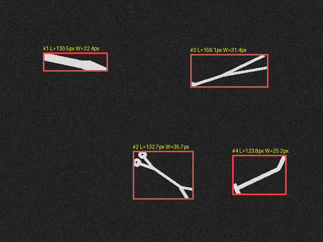

# MedBot Assist

MedBot Assist is the flagship integration project: simulated vision-guided instrument tray handling that connects [MedBot Vision](https://github.com/mghadia1/medbot-vision) detections through safety gates and calibrated transforms to [SurgiArm](https://github.com/mghadia1/surgiarm-sim)'s collision-aware planar pick-and-place coordinator.

> **What this is not:** autonomous surgery, clinical software, a medical device, ROS 2, Gazebo, or a hardware robot. All scenes, labels, and metrics are generated-data evidence.



## Quickstart

```bash
# medbot-assist installs its two sibling projects from adjacent clones
git clone https://github.com/mghadia1/medbot-vision.git
git clone https://github.com/mghadia1/surgiarm-sim.git
git clone https://github.com/mghadia1/medbot-assist.git
cd medbot-assist
python3 -m venv .venv && source .venv/bin/activate
python -m pip install --upgrade pip
python -m pip install '.[dev,ml]'
python -m pip install ../medbot-vision ../surgiarm-sim

# run the tests (8)
python -m pytest -q

# run the end-to-end demo (scene -> detection -> gates -> transform -> pick/place)
medbot-assist demo --output outputs/demo --tool scalpel --seed 7
```

## Headline result (generated data only)

With the learned four-class CNN (trained on separately generated tool crops), **all 80 detected components across 20 randomized full-scene trials were classified correctly**. Eleven requested tasks passed every safety gate and completed end to end; **nine were safely rejected** because confidence fell below the 0.80 gate — the threshold was deliberately not lowered to inflate the success count. Full numbers, the oracle-labeled comparison, and the domain-shift analysis: [docs/results.md](docs/results.md).

## Honest class-label boundary

MedBot Vision finds geometry but does not classify instrument types. MedBot Assist supports two explicit label sources: simulator-ground-truth oracle labels for debugging, and a four-class CNN trained on separately generated tool crops. The learned classes are still synthetic; they are not evidence of recognition in real surgical images.

## More commands

```bash
medbot-assist evaluate --output outputs/evaluation --trials 20 --seed 101
```

The demo writes the source scene, detector annotation, ground truth, detection messages, assist result, and a robot-state GIF. Evaluation varies instrument locations and angles and preserves one row per trial.

Train and use the learned synthetic tool classifier:

```bash
medbot-assist make-classifier-data --output outputs/classifier-data
medbot-assist train-classifier \
  --data outputs/classifier-data/tool-crops.npz \
  --output outputs/classifier
medbot-assist demo \
  --output outputs/learned-demo \
  --tool scalpel \
  --classifier outputs/classifier/tool-classifier.pt
medbot-assist evaluate \
  --output outputs/learned-evaluation \
  --trials 20 \
  --classifier outputs/classifier/tool-classifier.pt
```

## Implemented safety behavior

- strict synthetic component-count validation;
- explicit oracle or learned-label provenance;
- missing/duplicate request rejection;
- stale/future timestamp rejection;
- confidence threshold;
- calibrated-image bounds check;
- projective camera-to-tray mapping;
- rigid tray-to-robot transform;
- planning-failure propagation;
- a four-class PyTorch CNN trained and tested on generated tool crops;
- eight automated integration, ML-shape, and failure tests.

Read [How it works](docs/how-it-works.md) before describing the project.

The measured demonstration, trial results, and safe-rejection analysis are recorded in [Results](docs/results.md).

## Future full flagship

The project still requires real-image multi-class perception, physical calibration error measurement, ROS 2, TF2, Gazebo, MoveIt, ros2_control, physics, hardware-independent verification, and repeated supported-Linux end-to-end trials. None are current implementation claims.
